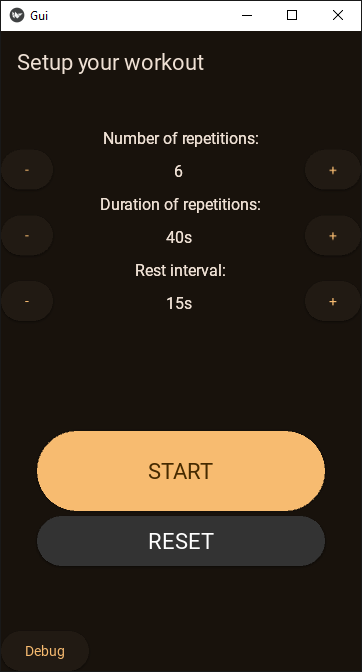
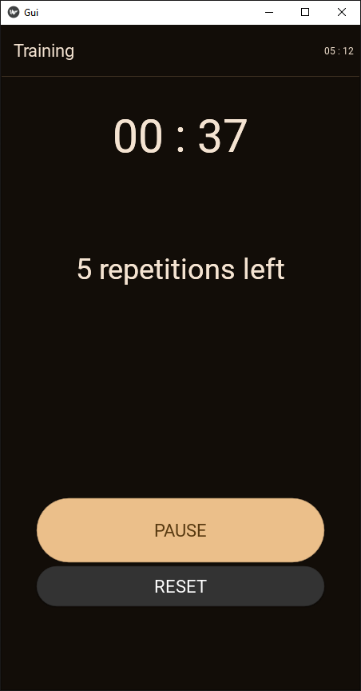

# Kivy Interval Timer

  
  

A practical interval training application developed with **Python** and **KivyMD**. This project was created to solve a personal need for a customizable workout timer while practicing mobile-oriented UI logic.

## Key Features
- **Customizable Intervals:** Users can define the number of repetitions, duration of repetitions, and rest intervals.
- **Real-time Status:** Automatic updates and notifications for current training phases (Work/Rest).
- **Automated Calculations:** The app calculates total session time based on user input.

## Tech Stack
- **Language:** Python
- **Frameworks:** Kivy & KivyMD
- **IDE:** PyCharm

### Last changes:
- **Fixed:** Resolved timer precision issue where rapid toggling of the pause button caused countdown acceleration.
- **UI:** Cleaned up interface by removing the debug button from the UI.

### Planned Enhancements:
- **Audio Integration:** Implementing sound for interval transitions.
- **UI Polishing:** Refining the visual interface for a more intuitive user experience.
- **Settings Page:** - Add a toggle to enable/disable the **Debug Mode**. Implement an "Advanced User" mode to bypass min/max constraints for full customization.
- **Data Persistence:** Implement local storage to remember user settings and training configurations for future sessions.
- **Android Port:** Finalizing the build process for Android devices.
